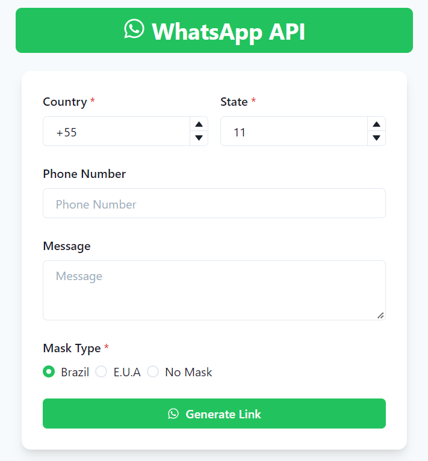

<p align="center">
  
</p>

<p align="center">
  <a href="#-technologies">Technologies</a>&nbsp;&nbsp;&nbsp;|&nbsp;&nbsp;&nbsp;
  <a href="#-project">Project</a>&nbsp;&nbsp;&nbsp;|&nbsp;&nbsp;&nbsp;
  <a href="#-screenshot">Screenshot</a>&nbsp;&nbsp;&nbsp;|&nbsp;&nbsp;&nbsp;
  <a href="#-how-to-run">How to run</a>&nbsp;&nbsp;&nbsp;|&nbsp;&nbsp;&nbsp;
  <a href="#-license">License</a>
</p>

<p align="center">
  
</p>

<br>

## 🌎 Available on <https://whats-api.herokuapp.com/>

## 🧪 Technologies

This project was developed with the following technologies:

- [React](https://reactjs.org)
- [Next.js](https://nextjs.org/)
- [TypeScript](https://www.typescriptlang.org/)

## 🍺 Project

WhatsApp API is a simple app that allows you to generate links with or without a phone number.

This allows you to generate links to your WhatsApp or send pre written messages easily.

The project uses:

✔ React

✔ Next.js

✔ TypeScript

✔ i18n

✔ Chakra UI

The internacionalization gets your system language, but you can change by adding `/en` or `/pt-BR` at the end of the URL. In this project it has only two languages supported, fallbacking to the `en` (English) language.

## 🖼 Screenshot

<p align="center">
     
</p>
## 🚀 How to run

Clone the project and access its folder.

```bash
git clone git@github.com:thefalked/Whats-API.git
cd Whats-API
```

To start it, follow the steps below:

```bash
# Install dependencies
$ yarn

# Start the project
$ yarn start
```

The app will be available in your browser on the address `http://localhost:3000`.

## 📝 Todos

- [x] Be able to send the text without an specific number
- [x] Visual update
- [ ] Use cookies to save last info
- [ ] Create a list with last info generated by the user

## ➕ Learn More

You can learn more in the [Nextjs Getting Started documentation](https://nextjs.org/docs/getting-started).

To learn React, check out the [React documentation](https://reactjs.org/).

## 📝 License

This project is under the MIT license. See the [LICENSE](LICENSE) file for more details.
